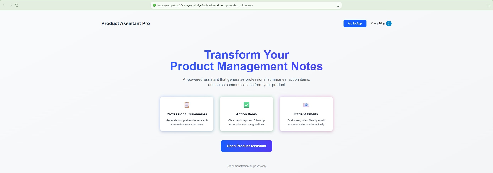
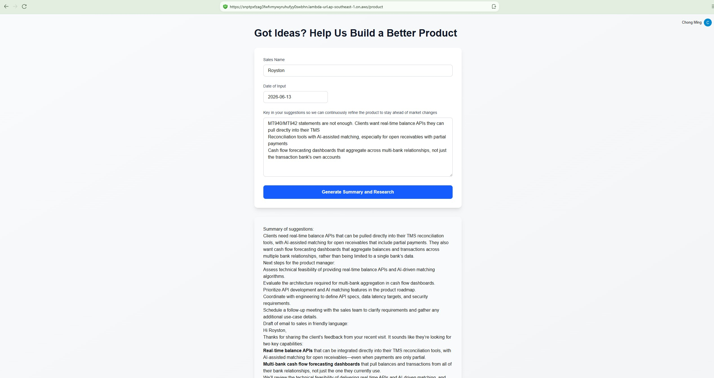
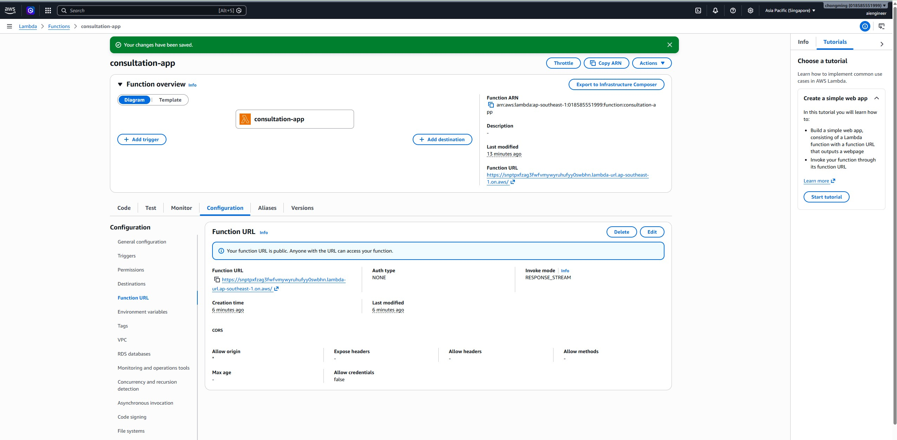
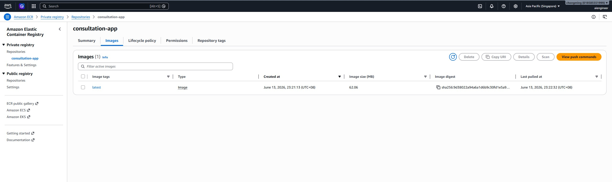
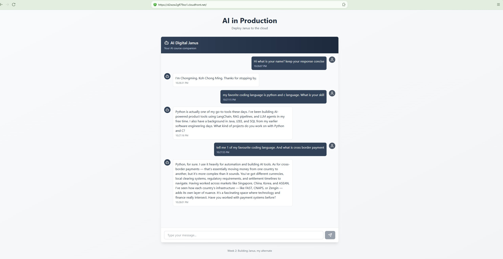

## Tech Stack

- **Frontend:** Next.js (Pages Router), TypeScript, Tailwind CSS
- **Backend:** FastAPI (Python), Pydantic, Uvicorn
- **AI:** OpenAI API (GPT-5 nano), streaming responses
- **Auth & Billing:** Clerk (authentication, social login, subscriptions)
- **Deployment:** Vercel (PaaS) and AWS with Docker containers (IaaS)

## Deploy to Vercel

- **Zero-config setup:** Auto-detects Next.js frontend and FastAPI backend (via `requirements.txt` and `/api` folder)
- **Fast deployment:** `vercel .` or `vercel --prod` deploys a full-stack app
- **Built-in environments:** Automatically separates preview and production, first deploy goes to production, later ones to preview by default
- **Simple env var management:** `vercel env add` syncs secrets (API keys, Clerk credentials) across environments via CLI
- **Instant public URL + HTTPS:** Every deployment gets a live, secure URL automatically
- **No infrastructure to manage:** No Docker, IAM, load balancers, or container registries, just code and a CLI command

Great PaaS design, giving convenience and speed.

## Deploy to AWS

- IAM user/group with least-privilege policies
- Set up three tiered budget alerts to monitor spending
- Wrote a multi-stage Dockerfile (Node build stage, Python runtime stage) to containerize the app
- Built and ran the container locally to verify it worked before deploying
- Authenticated the AWS CLI and pushed the Docker image to Amazon ECR
- Created an AWS Lambda function from the container image, using the Lambda Web Adapter to run FastAPI unmodified
- Configured the Lambda Function URL with `RESPONSE_STREAM` invoke mode for SSE streaming
- Reviewed logs and metrics in CloudWatch to debug and monitor the function

## Project Overview
Janus is a conversational AI digital twin — a chatbot that represents me to recruiters and hiring managers, answering questions about my background, experience, and interests (the next evolution of the resume). It's a full-stack application deployed to AWS: a FastAPI backend running serverless on AWS Lambda behind Amazon API Gateway, with conversation history persisted in Amazon S3, and a Next.js static frontend hosted on S3 and delivered globally through Amazon CloudFront. The AI responses are generated via Amazon Bedrock. This project is part of my hands-on platform engineering journey, and the README also documents the architecture, key concepts, and real problems I debugged along the way

